# Ian Truong Photography

Production source for [iantruongphotography.com](https://iantruongphotography.com): a public photography portfolio, private client galleries, and an administration portal. The frontend is React/Vite; the application backend is primarily Python 3.12 on AWS Lambda, with a Node.js/Sharp image-preview worker.

The production design is serverless and edge-first. Public HTML, JavaScript, CSS, API catalog responses, and media previews are served through CloudFront where appropriate; protected operations use API Gateway, Cognito, Lambda, DynamoDB, and short-lived S3 capabilities. Large uploads and background work do not pass through the browser API.

## What the site provides

- Responsive public photo and video albums with progressive previews, exploration, social metadata, and random-photo discovery.
- Private client accounts, owner-scoped galleries, and unlisted shared albums protected by server-side authorization and Turnstile/rate-limit controls.
- Administrative album, media, gallery-order, user, hero, analytics, cost, Google Drive, GitHub, audit, and site-health management.
- Direct presigned media uploads, EXIF extraction, responsive preview generation, HLS video processing, ZIP downloads, print handoff, and optional Google Drive backup.
- Structured application/security audit logging, CloudWatch alarms and dashboards, WAF controls, drift audits, GuardDuty, Config, Security Hub, IAM Access Analyzer, AWS Backup, and cross-Region backup infrastructure.

## High-level AWS architecture

The following diagram maps the browser edge, API front door, application handlers, data stores, media pipeline, asynchronous workers, third-party providers, CI/CD, security services, observability, and recovery paths. Solid arrows represent normal request/data flow. Dashed arrows represent scheduled, control-plane, invalidation, monitoring, or failure-routing relationships.

```mermaid
flowchart TB
  classDef actor fill:#e8f1ff,stroke:#2563eb,color:#0f172a
  classDef edge fill:#e9d5ff,stroke:#7e22ce,color:#2e1065
  classDef compute fill:#dcfce7,stroke:#16a34a,color:#14532d
  classDef data fill:#fef3c7,stroke:#d97706,color:#451a03
  classDef security fill:#fee2e2,stroke:#dc2626,color:#450a0a
  classDef ops fill:#e0f2fe,stroke:#0284c7,color:#082f49
  classDef provider fill:#f3f4f6,stroke:#6b7280,color:#111827

  visitor["Public visitor"]:::actor
  client["Authenticated client<br/>private gallery user"]:::actor
  admin["Administrator<br/>browser portal"]:::actor
  github["GitHub Actions<br/>PR, main release, manual recovery,<br/>scheduled audit"]:::actor

  subgraph dns_layer["DNS and certificates"]
    route53["Route 53<br/>iantruongphotography.com<br/>www, prints, origin-api"]:::edge
    acm["ACM certificates<br/>CloudFront/global and regional API"]:::security
  end

  subgraph edge_layer["Global edge and browser delivery"]
    frontend_cf["Frontend CloudFront distribution<br/>static site, /api behavior, print.html<br/>canonical + optional www/prints aliases"]:::edge
    frontend_bucket["Existing frontend S3 bucket<br/>private, OAC-backed, no public writes"]:::data
    frontend_functions["CloudFront Functions<br/>www redirect and social-route handling"]:::compute
    edge_waf["CloudFront WAFv2<br/>managed threat rules<br/>API per-IP and global circuit breakers<br/>lower Explore limits"]:::security
    api_edge["Same-origin /api behavior<br/>public GET cache allowlist<br/>private API no cache/cookies<br/>adds X-Origin-Verify"]:::edge
    print_page["print.html<br/>isolated Fotomoto CSP and permissions"]:::edge
    media_cf["Media CloudFront distribution<br/>HTTPS, HTTP/2/3, cache policies<br/>public previews and protected media paths"]:::edge
    preview_rewrite["CloudFront Function<br/>strict public-preview UUID/version rewrite"]:::compute
  end

  subgraph api_front_door["Regional API front door — us-west-2"]
    api_domain["Regional API custom domain<br/>origin-api.iantruongphotography.com<br/>CloudFront-only origin header required"]:::edge
    api_gateway["API Gateway HTTP API / prod<br/>Cognito JWT default authorizer<br/>25 requests/sec, 50 burst default"]:::compute
    cognito["Amazon Cognito<br/>admin-created users, email verification<br/>optional TOTP MFA, Admins group"]:::security
    app_iam["Per-function IAM roles<br/>least privilege and resource-scoped access<br/>dedicated MediaConvert role"]:::security
  end

  subgraph api_handlers["API handlers — Python 3.12 unless noted"]
    public_handlers["Public reads<br/>GetPublicAlbums<br/>GetPublicAlbum<br/>GetPhotographyStats"]:::compute
    identity_handlers["Identity and shared access<br/>Login<br/>CompleteChallenge<br/>GetSharedAlbum"]:::compute
    admin_read_handlers["Protected reads and administration<br/>GetAlbums, GetAlbum<br/>GetAdminAlbumMedia, ListUsers<br/>GetSiteHealth, GetAuditLog"]:::compute
    admin_write_handlers["Protected content/user writes<br/>CreateAlbum, UpdateAlbum<br/>UpdateGalleryOrder, DeleteAlbum<br/>AddImages, DeleteImages, UpdateImage<br/>HeroCover, CreateUser, EditUser, DeleteUser"]:::compute
    media_handlers["Media capabilities<br/>GetUploadUrl, GetDownloadUrl<br/>CreateZip, PreparePrint"]:::compute
    report_handlers["Reports and integrations<br/>GetCostReport, GetAnalyticsReport<br/>GetGoogleDriveUsage, GetGitHubAnalytics"]:::compute
    public_ingest_handlers["Anonymous bounded writes<br/>Contact, AnalyticsIngest"]:::compute
  end

  subgraph data_plane["Application data and media plane"]
    albums_table["DynamoDB AlbumsTable<br/>public/private/unlisted state<br/>ShareCode, visibility, summary,<br/>owner and ordering indexes; PITR"]:::data
    settings_table["DynamoDB GallerySettingsTable<br/>gallery order/settings"]:::data
    album_media_table["DynamoDB AlbumMediaTable<br/>normalized paginated media<br/>AlbumOrderIndex"]:::data
    preview_table["DynamoDB PreviewMetadataTable<br/>preview status/keys/manifests<br/>TTL and active stream"]:::data
    rate_table["DynamoDB RateLimitTable<br/>HMAC-scoped fixed-window limits<br/>TTL and PITR"]:::data
    analytics_table["DynamoDB AnalyticsTable<br/>aggregate counters only<br/>TTL"]:::data
    cache_tables["DynamoDB cache tables<br/>CostReportCache<br/>DriveUsageCache<br/>GitHubAnalyticsCache"]:::data
    secrets["Managed secrets and parameters<br/>SSM: front-door, rate-limit, Resend,<br/>Turnstile, Google OAuth<br/>Secrets Manager: print-session HMAC"]:::security
    image_bucket["Private S3 ImagesBucket<br/>Block Public Access, versioning,<br/>BucketOwnerEnforced, TLS-only<br/>object visibility tags and lifecycle"]:::data
    media_logs["S3 media access-log bucket<br/>retained CloudFront logs"]:::data
  end

  subgraph async_plane["Queues, streams, and background workers"]
    preview_queue["SQS PreviewQueue<br/>SSE, long polling, bounded worker concurrency"]:::ops
    preview_dlq["SQS PreviewDeadLetterQueue"]:::ops
    cache_queue["SQS CacheInvalidationQueue"]:::ops
    random_queue["SQS RandomPhotoRefreshQueue"]:::ops
    hover_queue["SQS HoverPreviewRefreshQueue"]:::ops
    async_failure["SQS AsyncFailureQueue<br/>shared failure destination"]:::ops
    cache_worker["CacheInvalidationWorker<br/>Python"]:::compute
    hover_worker["HoverPreviewManifestBuilder<br/>Python; stream + queue + reconciliation"]:::compute
    random_worker["RandomPhotoPoolBuilder<br/>Python; queue + hourly reconciliation"]:::compute
    preview_worker["PreviewWorker<br/>Node.js 22 + Sharp<br/>3 GB memory, concurrency 2"]:::compute
    zip_worker["WorkerZip<br/>Python; streamed multipart ZIP<br/>900-second timeout, concurrency 2"]:::compute
    drive_worker["GoogleDriveBackup<br/>Python; idempotent S3-to-Drive worker"]:::compute
    tag_worker["TagMediaObject<br/>visibility/tag transition worker"]:::compute
    media_backfill["AlbumMediaBackfill<br/>normalized-media migration worker"]:::compute
    drive_refresh["RefreshGoogleDriveUsage<br/>daily EventBridge entry point"]:::compute
    github_refresh["RefreshGitHubAnalytics<br/>hourly EventBridge entry point"]:::compute
  end

  subgraph media_processing["Media processing"]
    mediaconvert["AWS Elemental MediaConvert<br/>HLS/video transcode jobs<br/>restricted service role"]:::compute
    temp_objects["S3 temporary objects<br/>ZIPs, hero staging, pending media<br/>short lifecycle/visibility"]:::data
  end

  subgraph external_providers["External providers"]
    turnstile["Cloudflare Turnstile<br/>server-side hostname/action verification"]:::provider
    resend["Resend<br/>transactional contact/admin email"]:::provider
    google_drive["Google Drive<br/>optional album backup and usage report"]:::provider
    github_api["GitHub API<br/>cached repository analytics"]:::provider
    fotomoto["Fotomoto<br/>isolated print-store experience"]:::provider
  end

  subgraph ops_plane["Operations, security, observability, and recovery"]
    ci_bootstrap["CI bootstrap stack<br/>GitHub OIDC provider<br/>plan, execute, frontend, and audit roles<br/>release bucket + KMS"]:::ops
    sam_release["SAM/CloudFormation release path<br/>immutable artifacts, checksums/SBOM/provenance,<br/>guarded change sets and invariant checks"]:::ops
    waf_stack["ian-photography-front-door-waf<br/>us-east-1 CloudFront-scope WAF stack"]:::security
    audit_stack["ian-photography-security-audit<br/>CloudTrail, retained audit S3/Object Lock,<br/>KMS, security log group"]:::security
    managed_security["ian-photography-security-managed<br/>Config rules, GuardDuty, Security Hub,<br/>IAM Access Analyzer, Config delivery"]:::security
    notifications["ian-photography-security-notifications<br/>EventBridge, SNS, security signal SQS,<br/>DLQ, privacy-safe processor"]:::security
    observability["ian-photography-observability<br/>CloudFront monitoring, application alarms,<br/>dashboard, latency/5xx/queue signals"]:::ops
    cloudwatch["CloudWatch application/API logs,<br/>metric filters, alarms, X-Ray traces"]:::ops
    backup_primary["ian-photography-backup-primary<br/>us-west-2 AWS Backup vault and daily<br/>DynamoDB metadata protection"]:::ops
    backup_replica["ian-photography-backup-replica<br/>us-east-2 encrypted destination vault<br/>for planned/explicit recovery copies"]:::ops
  end

  visitor --> route53
  client --> route53
  admin --> route53
  route53 --> frontend_cf
  route53 --> api_domain
  acm -. certificate .-> frontend_cf
  acm -. certificate .-> api_domain
  frontend_cf --> frontend_bucket
  frontend_functions -. viewer routing .-> frontend_cf
  edge_waf -. attached to frontend distribution .-> frontend_cf
  frontend_cf --> api_edge
  frontend_cf --> print_page
  api_edge --> api_domain
  frontend_cf -. media URLs .-> media_cf
  preview_rewrite -. viewer request .-> media_cf
  media_cf --> image_bucket
  media_cf -. access logs .-> media_logs

  api_domain --> api_gateway
  api_gateway --> public_handlers
  api_gateway --> identity_handlers
  api_gateway --> admin_read_handlers
  api_gateway --> admin_write_handlers
  api_gateway --> media_handlers
  api_gateway --> report_handlers
  api_gateway --> public_ingest_handlers
  api_gateway --> cognito
  app_iam -. execution permissions .-> api_handlers

  public_handlers --> albums_table
  public_handlers --> album_media_table
  public_handlers --> preview_table
  public_handlers --> settings_table
  public_handlers -. public CDN URLs .-> media_cf
  identity_handlers --> cognito
  identity_handlers --> albums_table
  identity_handlers --> preview_table
  identity_handlers --> rate_table
  admin_read_handlers --> cognito
  admin_read_handlers --> albums_table
  admin_read_handlers --> album_media_table
  admin_read_handlers --> preview_table
  admin_read_handlers --> cache_tables
  admin_write_handlers --> cognito
  admin_write_handlers --> albums_table
  admin_write_handlers --> settings_table
  admin_write_handlers --> album_media_table
  admin_write_handlers --> preview_table
  admin_write_handlers --> image_bucket
  media_handlers --> albums_table
  media_handlers --> rate_table
  media_handlers --> image_bucket
  media_handlers -. protected presigned URLs .-> image_bucket
  report_handlers --> cache_tables
  report_handlers --> albums_table
  public_ingest_handlers --> rate_table
  public_ingest_handlers --> analytics_table
  public_ingest_handlers -. bot verification .-> turnstile
  identity_handlers -. bot verification .-> turnstile
  public_ingest_handlers -. email .-> resend
  admin_write_handlers -. email .-> resend
  api_handlers -. secret reads .-> secrets

  admin --> cognito
  client --> cognito
  admin_write_handlers --> preview_queue
  admin_write_handlers --> cache_queue
  admin_write_handlers --> random_queue
  admin_write_handlers --> hover_queue
  admin_write_handlers -. async Drive backup .-> drive_worker
  admin_write_handlers -. tag transitions .-> tag_worker
  admin_write_handlers -. video jobs .-> mediaconvert
  media_handlers -. ZIP job .-> zip_worker
  media_handlers --> temp_objects
  admin_write_handlers --> temp_objects

  preview_queue --> preview_worker
  preview_queue -. failed messages .-> preview_dlq
  preview_worker --> image_bucket
  preview_worker --> preview_table
  preview_worker -. CDN invalidation .-> media_cf
  preview_worker -. failure .-> async_failure
  cache_queue --> cache_worker
  cache_worker -. frontend invalidation .-> frontend_cf
  cache_worker -. failure .-> async_failure
  hover_queue --> hover_worker
  preview_table -. DynamoDB Stream .-> hover_worker
  hover_worker --> preview_table
  hover_worker --> image_bucket
  hover_worker -. failure .-> async_failure
  random_queue --> random_worker
  random_worker --> preview_table
  random_worker --> albums_table
  random_worker -. failure .-> async_failure
  zip_worker --> image_bucket
  zip_worker --> temp_objects
  zip_worker -. failure .-> async_failure
  drive_worker --> image_bucket
  drive_worker --> albums_table
  drive_worker -. provider backup .-> google_drive
  drive_worker -. failure .-> async_failure
  tag_worker --> image_bucket
  tag_worker -. failure .-> async_failure
  media_backfill --> albums_table
  media_backfill --> album_media_table
  media_backfill -. failure .-> async_failure
  drive_refresh --> cache_tables
  drive_refresh --> albums_table
  drive_refresh -. provider report .-> google_drive
  github_refresh --> cache_tables
  github_refresh -. provider report .-> github_api
  image_bucket --> mediaconvert
  mediaconvert --> image_bucket

  subgraph schedules["EventBridge schedules and database triggers"]
    schedule["Schedules<br/>hover reconciliation: 15 min<br/>media backfill: 15 min<br/>random pool: hourly<br/>Drive usage: daily<br/>GitHub analytics: hourly"]:::ops
    preview_stream["PreviewMetadataTable stream<br/>active trigger"]:::ops
    album_stream["AlbumsTable stream mapping<br/>retained for compatibility; disabled"]:::ops
  end
  schedule -. scheduled invokes .-> hover_worker
  schedule -. scheduled invokes .-> random_worker
  schedule -. scheduled invokes .-> media_backfill
  schedule -. scheduled invokes .-> drive_refresh
  schedule -. scheduled invokes .-> github_refresh
  preview_stream --> hover_worker
  album_stream -. retained mapping .-> random_worker

  print_page --> fotomoto
  media_handlers -. five-minute print capability .-> fotomoto

  github --> ci_bootstrap
  ci_bootstrap --> sam_release
  sam_release -. deploys .-> api_front_door
  sam_release -. deploys .-> api_handlers
  sam_release -. deploys .-> data_plane
  sam_release -. deploys .-> async_plane
  sam_release -. deploys .-> media_processing
  sam_release -. deploys .-> observability
  sam_release -. deploys .-> backup_primary
  sam_release -. deploys .-> backup_replica
  sam_release -. guarded association .-> waf_stack
  waf_stack -. owns/updates .-> edge_waf

  api_gateway -. access logs/metrics .-> cloudwatch
  api_handlers -. structured logs/X-Ray .-> cloudwatch
  async_plane -. queue age/failure metrics .-> cloudwatch
  frontend_cf -. edge metrics .-> observability
  media_cf -. edge metrics .-> observability
  edge_waf -. WAF logs/alarms .-> observability
  cloudwatch --> notifications
  observability --> notifications
  backup_primary --> notifications
  managed_security --> notifications
  audit_stack --> notifications
  albums_table -. protected metadata backup .-> backup_primary
  preview_table -. protected metadata backup .-> backup_primary
  backup_primary -. recovery-copy destination .-> backup_replica
  audit_stack -. CloudTrail records .-> cloudwatch
  managed_security -. posture findings .-> notifications
```



An editable companion architecture board is available in [Miro](https://miro.com/app/board/uXjVHsf6LH0=/). It is organized as a six-zone overview plus a detailed resource-inventory appendix.

### Architecture notes

1. **Two CloudFront paths serve different purposes.** The existing frontend distribution serves the React application and same-origin `/api` requests. The separate media distribution serves public derivatives and selected media paths from a private S3 origin. The browser never uses the regional API hostname as its normal API base.
2. **The API front door is defense in depth.** CloudFront adds `X-Origin-Verify`; Lambda handlers verify it before authentication, validation, or business work. Production has the front-door enforcement switch enabled and the default `execute-api` endpoint disabled. The regional custom domain intentionally returns a fixed denial when called without the CloudFront header.
3. **Large media bypasses the API data path.** Administrators obtain short-lived upload capabilities, upload directly to S3, and then commit metadata through protected API routes. Public media uses CDN URLs; protected downloads and print handoffs use short-lived capabilities.
4. **Visibility is enforced at multiple layers.** Cognito/API authorization controls routes and album access; S3 blocks direct public access; CloudFront origin access is restricted to the distribution; object visibility tags gate non-public media; and public-preview paths are validated and rewritten to canonical derivative keys.
5. **Writes are intentionally asynchronous.** Preview generation, cache invalidation, random pools, hover manifests, ZIP creation, Google Drive backup, and video processing are decoupled with SQS, DynamoDB Streams, EventBridge schedules, bounded concurrency, and failure queues.
6. **The application and operations stacks are separate.** `backend/template.yaml` owns the API, Lambda functions, Cognito, application DynamoDB tables, private media bucket, media CloudFront distribution, application logs, queues, and application alarms. `ops/` owns the existing frontend edge configuration, WAF, security services, observability, backups, notifications, DNS hardening, and guarded operational tooling.

## Current production topology

| Area | Current configuration |
|---|---|
| Application Region | `us-west-2`, stage `prod`, CloudFormation stack `ian-website` |
| Browser API base | Same-origin `/api` through the frontend CloudFront distribution |
| Regional API origin | `origin-api.iantruongphotography.com`; not the browser API base |
| API bypass protection | Front-door verification enabled; default `execute-api` endpoint disabled |
| Media privacy guard | CloudFront non-public object denial enabled; direct S3 access denied |
| WAF | CloudFront-scope WAF in `us-east-1`, attached to the frontend distribution |
| Backup recovery | Primary backup stack in `us-west-2`; encrypted recovery-copy destination vault in `us-east-2` |
| Public caching | Reviewed public API query-string allowlist and CDN caching; protected responses are no-store |

The production release guard requires the private-media, front-door, disabled-execute-api, and completed-index invariants before deployment. The live public-posture smoke verifies canonical API success, direct-origin denial, disabled execute-api behavior, protected `401` behavior, security headers, and direct S3 denial.

## Repository layout

```text
├── .github/                 # Main-branch release, PR, rollback, and scheduled audit workflows
├── backend/
│   ├── functions/           # Python Lambda handlers and shared security/business helpers
│   ├── preview_worker/      # Node.js/Sharp preview worker and contract tests
│   ├── tests/               # Backend unit and integration-style tests
│   ├── Makefile             # Explicit per-function source/dependency build allowlists
│   └── template.yaml        # AWS SAM application infrastructure
├── ops/
│   ├── ci/                  # Guarded deployment, audit, posture, and release-policy tooling
│   ├── tests/               # Infrastructure and operations tests
│   ├── *.yaml               # Reviewed supporting CloudFormation templates
│   └── README.md            # Production operations entry point
├── public/                  # Static public assets and security contact metadata
├── scripts/                 # Frontend build-time compatibility patches
├── src/                     # React components, pages, contexts, utilities, and tests
├── .env.example             # Public configuration contract; real .env files stay local
├── print.html               # Isolated print-store entry page
├── package.json             # Frontend development and verification commands
└── THIRD_PARTY_NOTICES.md   # Third-party dependency notices
```

Local security and performance review evidence may exist in the ignored `website_review/` directory and is intentionally not committed.

## Technology

- React 19, React Router 7, Vite 7, Tailwind CSS 4, Vitest, and Node.js 24 for frontend tooling.
- Python 3.12 Lambda functions managed with AWS SAM.
- Node.js 22/Sharp for the isolated image-preview worker.
- API Gateway HTTP API, Cognito, DynamoDB, S3, CloudFront, MediaConvert, Route 53, ACM, WAF, IAM, AWS Backup, CloudTrail, Config, GuardDuty, Security Hub, IAM Access Analyzer, CloudWatch, X-Ray, KMS, SQS, EventBridge, and SSM Parameter Store.
- Resend for transactional email, Cloudflare Turnstile for bot protection, Google Drive for optional media backup/reporting, GitHub for repository analytics, and Fotomoto for isolated print-store handoff.

## Local development

Use the Node version declared in `.node-version` and copy only public development values from `.env.example` into a local `.env`. Production uses the relative `/api` base so browser traffic cannot bypass the frontend edge controls.

```bash
npm ci
npm run dev
```

Never commit `.env`, provider credential JSON, media, build output, or locally generated evidence.

## Verification

The same core checks run before a production release:

```bash
npm run verify:ci
python3 -m pip install -r backend/requirements-dev.txt
(cd backend && PYTHONPATH=functions python3 -m coverage run --rcfile=.coveragerc -m unittest discover -s tests -p 'test_*.py' -v)
(cd backend && python3 -m coverage json --rcfile=.coveragerc && python3 ../ops/ci/coverage_gate.py coverage/backend/coverage.json)
npm --prefix backend/preview_worker ci
npm --prefix backend/preview_worker run test:coverage
python3 -m coverage run --rcfile=ops/.coveragerc -m unittest discover -s ops/tests -p 'test_*.py' -v
python3 -m coverage json --rcfile=ops/.coveragerc
python3 ops/ci/coverage_gate.py coverage/ops/coverage.json
bash ops/validate_infrastructure.sh --build
```

For live production posture, the credential-free smoke test is run through the configured CI variables:

```bash
./ops/ci/public_smoke.sh
```

The smoke test is not a load test. Capacity changes should also measure API `429`/`5xx` rates, Lambda throttles and concurrency, DynamoDB throttles, queue age/depth, CloudFront cache hit rate, WAF blocks, latency, and cost.

Additional workflow policy, artifact budgets, credential-history scanning, dependency checks, drift audits, public-posture checks, and deployment guards are documented in [`ops/CI_CD.md`](ops/CI_CD.md).

## Deployment model

`main` is the only deployment branch. Every push to `main` runs the full quality and security gate, builds immutable frontend and backend artifacts, records checksums/SBOM/provenance, plans the backend change set, deploys it only when the guarded plan is valid, deploys the frontend, and verifies public health. AWS access uses short-lived GitHub OIDC sessions restricted to the exact repository and `main` ref; no long-lived AWS credentials belong in GitHub.

The deployment path preserves the live stack parameters, binds packaged `CodeUri` values to immutable artifacts, rejects unexplained removals/replacements and protected-resource changes, and rechecks security/migration invariants after deployment. Manual release recovery and scheduled read-only security/drift audits remain available without introducing additional application branches or environments.

Operational runbooks begin at [`ops/README.md`](ops/README.md). The API front-door contract, rotation procedure, negative tests, and rollback process are in [`ops/API_FRONT_DOOR.md`](ops/API_FRONT_DOOR.md).

## Security boundary

- **Browser/API edge:** the browser uses `/api` on the canonical CloudFront distribution. The frontend WAF applies managed threat rules plus per-IP and distributed API rate limits. Public API caching is allowlisted by route, method, and query string; private requests forward authorization headers, never cookies, and are not cached.
- **Authentication:** Cognito issues the user tokens. API Gateway validates the issuer/audience, and protected handlers perform defense-in-depth claim validation and exact `Admins`-group/owner checks. Client-side route guards are only a user-experience layer.
- **Album authorization:** public albums require active public state; private albums require the owner or administrator; unlisted albums require an exact active share code plus abuse controls. Invalid/revoked shared access is intentionally indistinguishable from not found.
- **Media authorization:** the S3 bucket has Block Public Access, OAC-only CloudFront access, TLS-only policies, versioning, lifecycle controls, and visibility tags. Public previews are canonical, validated derivatives. Protected downloads and uploads use short-lived presigned capabilities and server-generated object keys.
- **Input and abuse controls:** request bodies, fields, identifiers, MIME types, extensions, object sizes, ZIP sizes, batch sizes, share codes, and analytics events are bounded and allowlisted. Turnstile and HMAC-scoped DynamoDB rate limits protect sensitive anonymous flows.
- **Secrets and logging:** provider credentials and origin/rate-limit secrets are loaded from managed AWS storage; logs omit tokens, bodies, query strings, paths, keys, and personal data. Application audit events use a fixed aggregate schema.
- **Deployment and account security:** IAM is split by function and deployment role. GitHub OIDC trust is exact-repository/exact-branch. CloudTrail, Config, GuardDuty, Security Hub, Access Analyzer, retained audit storage, WAF logs, backup alerts, CloudWatch alarms, and scheduled drift/posture checks provide independent operational controls.

For changes to authentication, storage, logging, backups, edge controls, or deployment policy, update the corresponding tests and runbooks in the same commit. Do not treat a successful infrastructure deployment as proof of privacy; the authorization matrix and live CDN/direct-storage tests remain required release gates.

## Operations and recovery

The application is deliberately bounded rather than unlimited: API throttles, WAF circuit breakers, reserved Lambda concurrency, SQS buffering, worker limits, object-size limits, and provider pagination limits protect availability and spend. This is appropriate for the portfolio/private-gallery workload, but high-load changes should be validated with representative traffic and media sizes.

DynamoDB point-in-time recovery, S3 versioning, AWS Backup, retained audit storage, and the `us-east-2` encrypted backup destination reduce recovery risk. The replica vault is a recovery destination, not proof that every backup is continuously copied there; verify the copy policy and perform a restore test before treating it as regional DR. Regional disaster recovery is still a restore/failover procedure rather than active-active serving; maintain tested restore steps and explicit RPO/RTO targets.
