# Website architecture atlas

Source-backed views of Ian Truong Photography. Start with 00, then use the numbered views to follow a specific journey. The [editable Miro board](https://miro.com/app/board/uXjVHsf6LH0=/) uses the same nodes and relationships. [Complete source inventory](ARCHITECTURE_INVENTORY.md) lists every route, application function, data store and explicit infrastructure resource.

## How to read the atlas

Each horizontal lane is one request, data or control flow, read left to right. Solid arrows represent requests or data movement; dashed arrows represent scheduled/control/operational work. A label states what crosses the boundary. Unconnected cards are separate controls or conditional resources, not implied data flows. Repeated names refer to the same component across views; numbered references avoid long arrows across unrelated sections.

Colors: blue = people/browser entry; teal = edge/delivery; lavender = app logic; amber = data; peach = workers; rose = access/security; purple = external provider; gray = operations. Labels carry the meaning without relying on color.

**Scope:** current checked-in source and documented production intent. Deployment switches and optional resources are identified explicitly. This work does not claim a fresh live AWS inventory or provider configuration audit.

## Views

| View | Question answered |
|---|---|
| [00 · System overview](#00-system) | Start here. Follow a lane left to right; open its numbered detail view. |
| [01 · Pages and visitor journeys](#01-experience) | The public experience, its shared components, and the services each journey uses. |
| [02 · Edge, identity and authorization](#02-edge-access) | Request boundaries are explicit: edge controls, verified identity, then resource access. |
| [03 · Catalog, indexes and data ownership](#03-catalog-data) | Authoritative album state decides access; derivative indexes accelerate discovery. |
| [04 · Uploads, previews, video and heroes](#04-media-ingestion) | Large bytes go directly to S3; protected API commits start processing. |
| [05 · Mutation consistency and background work](#05-consistency-workers) | Separate lanes explain invalidation, materialized views, reconciliation and failures. |
| [06 · Sharing, downloads and print orders](#06-sharing-delivery) | Public CDN access and short-lived capabilities have different privacy boundaries. |
| [07 · Browser-only photo editor](#07-local-editor) | The /editor workspace processes local files independently of the gallery backend. |
| [08 · Gallery camera-original comparisons](#08-original-comparisons) | Read-only Drive matching produces private Before previews; edited galleries stay authoritative. |
| [09 · Administration and integrations](#09-admin-integrations) | Admin reads and mutations connect to distinct data stores and provider responsibilities. |
| [10 · Build, release, rollback and ownership](#10-release-ownership) | The same tested artifacts move through separated roles and explicit deployment boundaries. |
| [11 · Observability, security and recovery](#11-operations-recovery) | Website incident delivery, account audit evidence and data recovery are separate paths. |

## 00 · System overview

Start here. Follow a lane left to right; open its numbered detail view. [Open this view in Miro](https://miro.com/app/board/uXjVHsf6LH0=/?moveToWidget=3458764682780829950).

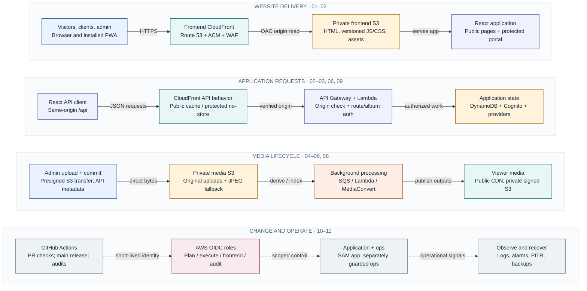

The browser-only editor (07) uses local files, Web Workers, WebGL and IndexedDB. It has no media-upload API. This atlas describes checked-in implementation and documented topology, not a fresh AWS deployment audit.

Sources: [src/App.jsx](../src/App.jsx), [backend/template.yaml](../backend/template.yaml), [ops/API_FRONT_DOOR.md](../ops/API_FRONT_DOOR.md), [ops/CI_CD.md](../ops/CI_CD.md).

## 01 · Pages and visitor journeys

The public experience, its shared components, and the services each journey uses. [Open this view in Miro](https://miro.com/app/board/uXjVHsf6LH0=/?moveToWidget=3458764682780830052).

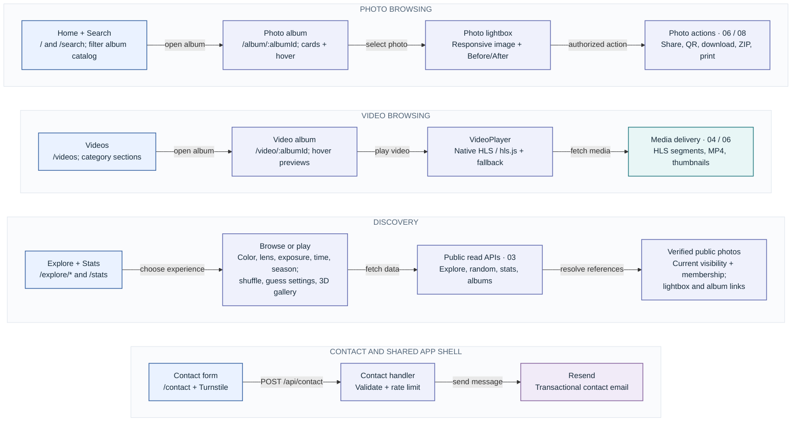

Shared shell: lazy routes/Suspense, AuthProvider, navigation, theme, accessibility, metadata/social links, analytics and PWA registration. /privacy explains data use; unmatched routes show NotFound. The immersive Three.js / React Three Fiber gallery uses streamed media and a WebGL capability fallback. Accounts are in 02, the local editor in 07, and admin tools in 09. The route inventory lists every URL.

Sources: [src/App.jsx](../src/App.jsx), [src/main.jsx](../src/main.jsx), [src/pages/Explore.jsx](../src/pages/Explore.jsx), [src/pages/ImmersiveGallery.jsx](../src/pages/ImmersiveGallery.jsx), [src/components/PhotoLightbox.jsx](../src/components/PhotoLightbox.jsx), [src/components/VideoPlayer.jsx](../src/components/VideoPlayer.jsx), [src/components/DocumentMetadata.jsx](../src/components/DocumentMetadata.jsx).

## 02 · Edge, identity and authorization

Request boundaries are explicit: edge controls, verified identity, then resource access. [Open this view in Miro](https://miro.com/app/board/uXjVHsf6LH0=/?moveToWidget=3458764682780830094).

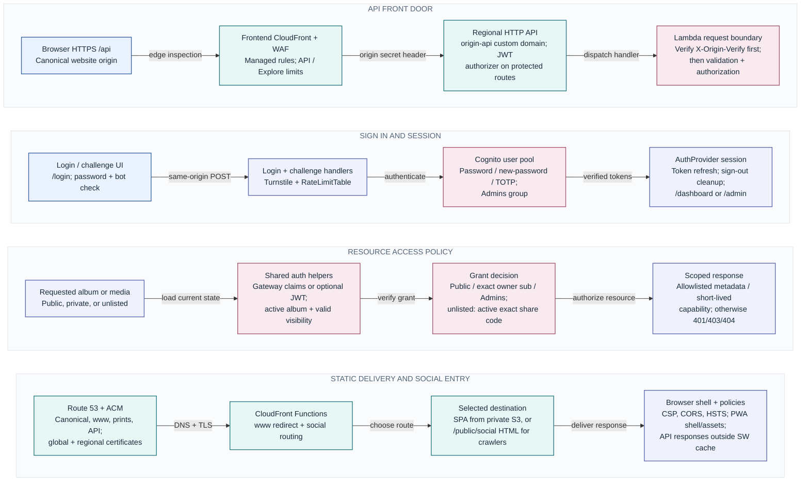

The normal browser API base is /api. The documented production contract disables execute-api and rejects direct regional-origin calls without the edge secret. Client ProtectedRoute checks Admins and MFA setup; backend admin handlers enforce verified Admins claims. Do not mistake a UI MFA gate for a per-request backend MFA claim check. Protected catalog snapshots are process-memory only; logout clears them. Resend/Turnstile/Google credentials are server-side SSM parameters; IAM scopes access and KMS decrypt where configured.

Sources: [ops/API_FRONT_DOOR.md](../ops/API_FRONT_DOOR.md), [ops/cloudfront_frontend.py](../ops/cloudfront_frontend.py), [ops/cloudfront_social_router.js](../ops/cloudfront_social_router.js), [backend/functions/front_door.py](../backend/functions/front_door.py), [backend/functions/auth_helpers.py](../backend/functions/auth_helpers.py), [backend/functions/album_access.py](../backend/functions/album_access.py), [src/context/authContext.jsx](../src/context/authContext.jsx), [src/components/ProtectedRoute.jsx](../src/components/ProtectedRoute.jsx), [public/service-worker.js](../public/service-worker.js).

## 03 · Catalog, indexes and data ownership

Authoritative album state decides access; derivative indexes accelerate discovery. [Open this view in Miro](https://miro.com/app/board/uXjVHsf6LH0=/?moveToWidget=3458764682780830147).

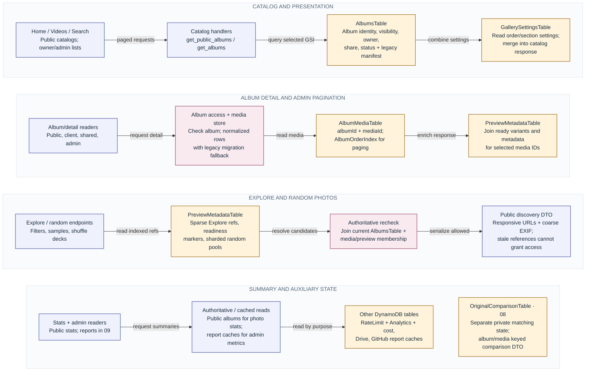

AlbumsTable GSIs: ShareCodeIndex, VisibilityCreatedAtIndex, VisibilityCreatedAtSummaryIndex and OwnerSubCreatedAtIndex (deployment-phase gated). Public queries never trust an index alone. Explore temporal readiness fails closed; color/lens and random decks retain bounded/legacy fallbacks. PreviewMetadataTable also stores hover pointers and random-pool generations. Each table's keys, TTL and infrastructure identity are listed in the inventory.

Sources: [backend/template.yaml](../backend/template.yaml), [backend/functions/get_public_albums.py](../backend/functions/get_public_albums.py), [backend/functions/get_public_album.py](../backend/functions/get_public_album.py), [backend/functions/album_media_store.py](../backend/functions/album_media_store.py), [backend/functions/media_access.py](../backend/functions/media_access.py), [backend/functions/explore_index.py](../backend/functions/explore_index.py), [backend/functions/random_photo_pools.py](../backend/functions/random_photo_pools.py), [backend/functions/photography_stats.py](../backend/functions/photography_stats.py).

## 04 · Uploads, previews, video and heroes

Large bytes go directly to S3; protected API commits start processing. [Open this view in Miro](https://miro.com/app/board/uXjVHsf6LH0=/?moveToWidget=3458764682780830586).

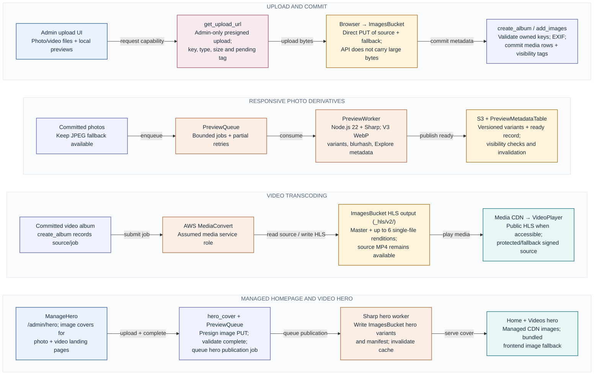

Videos are converted into an adaptive HLS ladder in `<source>_hls/v2/`: 2160p (16 Mbit/s peak), 1440p (10), 1080p (6.5), 720p (3.5), 540p (1.8) and 360p (0.8), H.264 QVBR with muxed AAC. Boxes follow the source orientation (a portrait video's "1080p" is 1080 wide), rungs that would only repeat a larger one for a smaller source are dropped, and every rendition is one TS file addressed by byte ranges, so a video is about a dozen objects whatever its length. The player picks a level from bandwidth and player size; the custom controls also offer a fixed quality (hls.js levels, or the variant playlist itself on Safari's native HLS). `VideoUpgradeFunction` (every 3 hours) gives converted videos still on the older two-rendition ladder an upgrade receipt, at most 8 new and 12 in flight; the album's durable video worker re-converts each from its original into the new folder and switches `hlsUrl` only once the new master playlist exists, then invalidates the public API cache. An upgrade that never completes within a day keeps the old stream.

Timeline previews: every conversion and upgrade also writes a 320-pixel JPEG frame every 2 seconds to `<source>_hls/frames/v1/<name>.NNNNNNN.jpg` (MediaConvert frame capture). The frames sit inside the stream's folder, so they share its visibility tags, cookies, retagging and deletion. Videos already on the current ladder get a cheap frame-only job from the same scan (up to 20 per run, as `frames` receipts). An image's `scrubFrames` is set once its job is accepted, and the API then returns a frame URL prefix wherever it returns the stream. The custom seek bar shows the frame and time under the pointer, or only the time when a frame is missing.

After commit, auxiliary jobs also refresh catalog caches, random pools, hover manifests, optional edited-file Drive backups (09), and original comparisons (08). Preview generation is additive: failure keeps source and JPEG fallback intact. Source media, previews, HLS, QR assets and temporary ZIPs share ImagesBucket but use separate prefixes and policies. No S3-upload event is assumed to dispatch these jobs; the implemented upload-completion path does.

Sources: [src/pages/Admin.jsx](../src/pages/Admin.jsx), [src/pages/UploadVideo.jsx](../src/pages/UploadVideo.jsx), [src/pages/ManageHero.jsx](../src/pages/ManageHero.jsx), [backend/functions/get_upload_url.py](../backend/functions/get_upload_url.py), [backend/functions/create_album.py](../backend/functions/create_album.py), [backend/functions/add_images.py](../backend/functions/add_images.py), [backend/functions/hero_cover.py](../backend/functions/hero_cover.py), [backend/functions/media_helpers.py](../backend/functions/media_helpers.py), [backend/functions/video_jobs.py](../backend/functions/video_jobs.py), [backend/functions/video_upgrade.py](../backend/functions/video_upgrade.py), [backend/preview_worker/index.mjs](../backend/preview_worker/index.mjs), [backend/preview_worker/hero.mjs](../backend/preview_worker/hero.mjs).

## 05 · Mutation consistency and background work

Separate lanes explain invalidation, materialized views, reconciliation and failures. [Open this view in Miro](https://miro.com/app/board/uXjVHsf6LH0=/?moveToWidget=3458764682780830632).

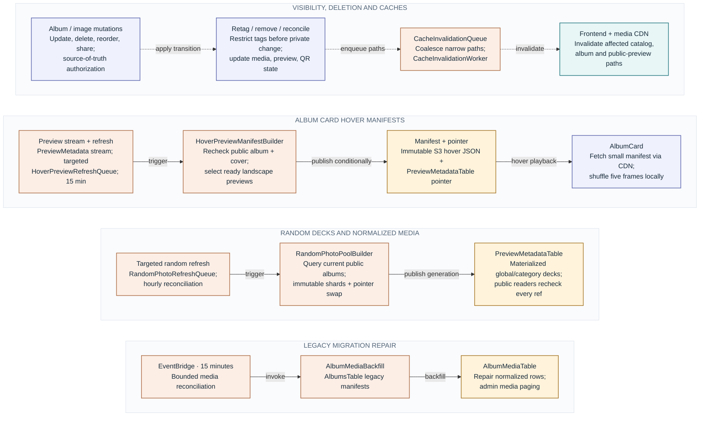

AlbumsTable → RandomPhotoPoolBuilder stream mapping is retained but disabled; the queue and hourly schedule are active. Preview and original-comparison queues have dedicated DLQs. Cache/random/hover queue redrive, failed hover stream batches, and async ZIP/Drive/tag invocations use AsyncFailureQueue where configured. Scheduled functions have bounded retries; do not assume every worker has a Lambda DLQ. TagMediaObject is the separate asynchronous tagging worker. Queue age, depth, worker errors/throttles and failures feed 11.

Scheduled publishing: an upload or edit can give a link-only album (sharing off) a `publishAt` time. The time is written first to the `scheduled-publishing` item in GallerySettingsTable, then to the album, which stays authoritative. Every 5 minutes EventBridge invokes UpdateAlbumFunction with `{"source": "scheduled-publish"}`. That run reads the one index item and moves up to 5 due albums to public through the normal visibility transition, which ends their schedule. It also repairs or drops index entries that disagree with their album, and leaves busy or still-uploading albums for the next run.

Recently Deleted: deleting an album in Manage Albums sends `{"trash": true}` to UpdateAlbumFunction. That is an ordinary visibility transition to link-only with sharing off, plus `trashedAt` and `trashedFrom` (the previous visibility, owner and share link). Public, client and shared-link access are revoked right away, and every admin list leaves the album out. The Recently Deleted page lists binned albums with `trashed=1`. `{"restore": true}` reverses the transition. Both requests are idempotent. The bin is indexed in the `recently-deleted` GallerySettingsTable item. A daily EventBridge input `{"source": "trash-purge"}` to DeleteAlbumFunction permanently deletes up to 3 albums binned 30 or more days ago through the normal deletion workflow. Account deletion also matches `trashedFrom.ownerSub`, so a client's binned albums are deleted with their account.

Sources: [backend/template.yaml](../backend/template.yaml), [backend/functions/update_album.py](../backend/functions/update_album.py), [backend/functions/delete_album.py](../backend/functions/delete_album.py), [backend/functions/delete_images.py](../backend/functions/delete_images.py), [backend/functions/cache_invalidation_worker.py](../backend/functions/cache_invalidation_worker.py), [backend/functions/hover_preview_manifest_builder.py](../backend/functions/hover_preview_manifest_builder.py), [backend/functions/random_photo_pool_builder.py](../backend/functions/random_photo_pool_builder.py), [backend/functions/backfill_album_media.py](../backend/functions/backfill_album_media.py), [backend/functions/tag_media_object.py](../backend/functions/tag_media_object.py).

## 06 · Sharing, downloads and print orders

Public CDN access and short-lived capabilities have different privacy boundaries. [Open this view in Miro](https://miro.com/app/board/uXjVHsf6LH0=/?moveToWidget=3458764682780830671).

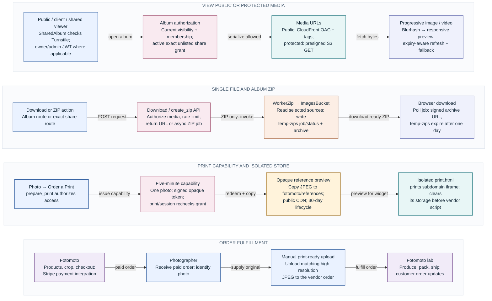

Public preview aliases rewrite to canonical tagged objects; direct public S3 access is denied. Original-comparison previews use the separate private bucket in 08. Share/QR URLs navigate back through access checks. Single-file downloads return a capability directly and do not use WorkerZip. Revocation blocks new capabilities; existing signed URLs remain valid until expiry, and redeemed Fotomoto references survive until lifecycle expiry. Fotomoto never receives AWS credentials or automatic access to print-resolution originals.

Sources: [backend/functions/get_shared_album.py](../backend/functions/get_shared_album.py), [backend/functions/media_access.py](../backend/functions/media_access.py), [backend/functions/get_download_url.py](../backend/functions/get_download_url.py), [backend/functions/create_zip.py](../backend/functions/create_zip.py), [backend/functions/worker_zip.py](../backend/functions/worker_zip.py), [backend/functions/prepare_print.py](../backend/functions/prepare_print.py), [src/utils/zipDownload.js](../src/utils/zipDownload.js), [src/print-main.js](../src/print-main.js), [ops/FOTOMOTO_PRINTS.md](../ops/FOTOMOTO_PRINTS.md).

## 07 · Browser-only photo editor

The /editor workspace processes local files independently of the gallery backend. [Open this view in Miro](https://miro.com/app/board/uXjVHsf6LH0=/?moveToWidget=3458764682780830717).

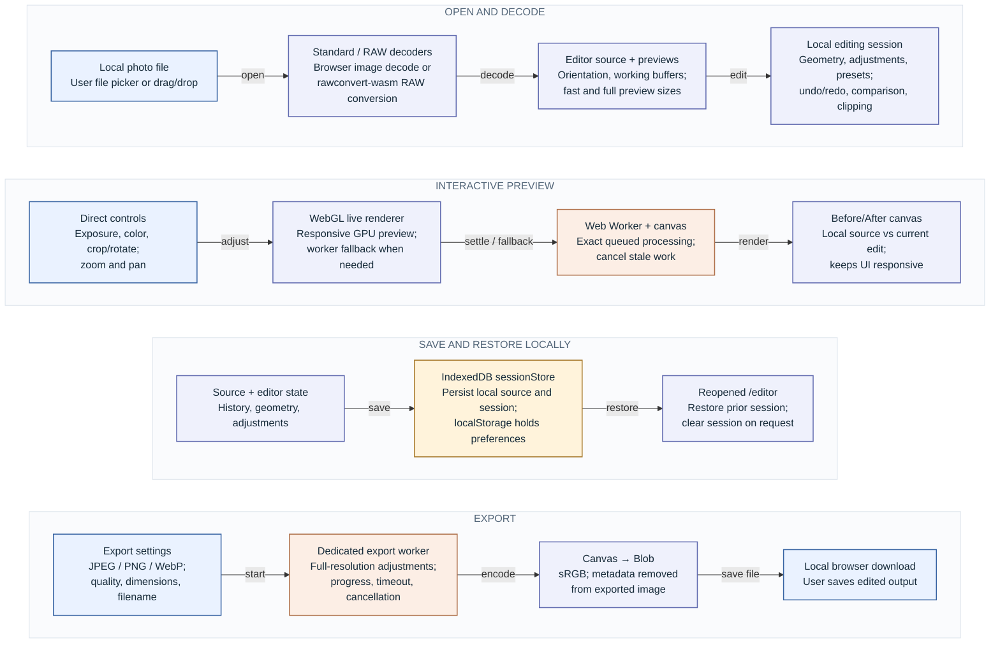

Local editor files and adjustments are not sent to an application media endpoint. Normal page-shell delivery and permitted page analytics still apply. The editor's local Before/After canvas is distinct from the gallery's server-generated camera-original comparisons in 08. RAW WASM has a build-time CSP compatibility patch in scripts/patch-rawconvert-csp.mjs.

Sources: [src/pages/Editor.jsx](../src/pages/Editor.jsx), [src/editor/rawDecoder.js](../src/editor/rawDecoder.js), [src/editor/standardDecoder.js](../src/editor/standardDecoder.js), [src/editor/livePreviewRenderer.js](../src/editor/livePreviewRenderer.js), [src/editor/editorWorker.js](../src/editor/editorWorker.js), [src/editor/sessionStore.js](../src/editor/sessionStore.js), [scripts/patch-rawconvert-csp.mjs](../scripts/patch-rawconvert-csp.mjs).

## 08 · Gallery camera-original comparisons

Read-only Drive matching produces private Before previews; edited galleries stay authoritative. [Open this view in Miro](https://miro.com/app/board/uXjVHsf6LH0=/?moveToWidget=3458764682780830888).

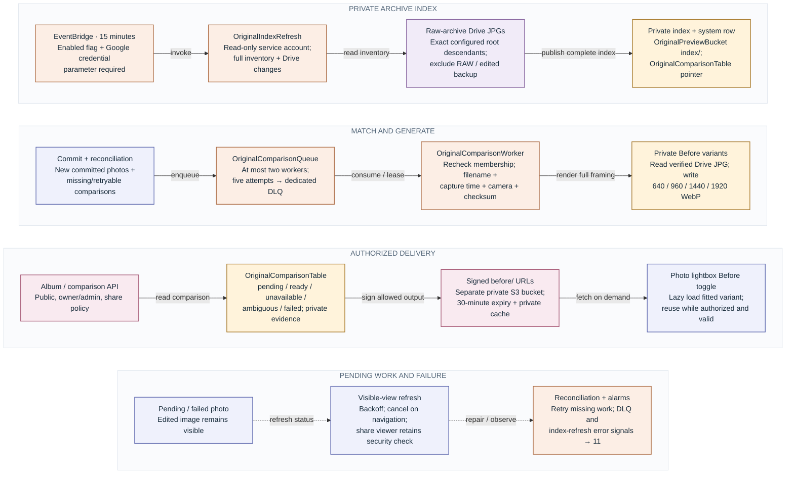

The read-only archive reader does not use the edited-backup OAuth writer. It never modifies Drive or publishes a partial index. The worker strips EXIF/GPS/XMP/ICC, preserves full framing, and stores derivatives rather than source camera JPGs. Even public-album Before previews have no public CDN alias. API DTOs exclude Drive IDs, source names and matching evidence. This feature is parameter-gated; source configuration alone does not establish live activation or backfill completion.

Sources: [ops/PHOTO_ORIGINAL_COMPARISONS.md](../ops/PHOTO_ORIGINAL_COMPARISONS.md), [backend/functions/original_index_refresh.py](../backend/functions/original_index_refresh.py), [backend/functions/original_drive.py](../backend/functions/original_drive.py), [backend/functions/original_match.py](../backend/functions/original_match.py), [backend/functions/original_comparison_worker.py](../backend/functions/original_comparison_worker.py), [backend/functions/original_comparison_access.py](../backend/functions/original_comparison_access.py), [src/hooks/usePhotoOriginalRefresh.js](../src/hooks/usePhotoOriginalRefresh.js).

## 09 · Administration and integrations

Admin reads and mutations connect to distinct data stores and provider responsibilities. [Open this view in Miro](https://miro.com/app/board/uXjVHsf6LH0=/?moveToWidget=3458764682780888933).

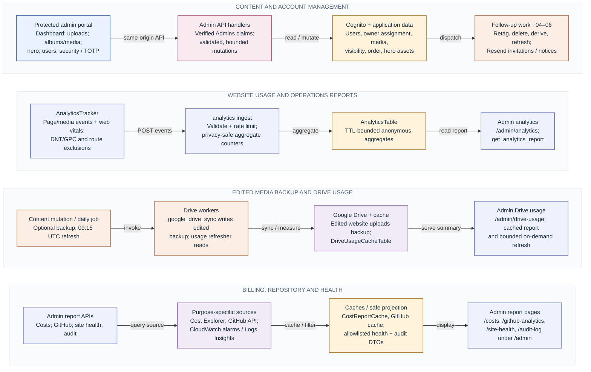

GitHub analytics refresh runs hourly at :20 UTC; Drive usage refresh runs daily at 09:15 UTC. Report APIs can use bounded refresh/cache paths. Google Drive's edited backup writer is distinct from the read-only raw archive matcher (08). Resend also handles contact (01); Turnstile protects login/contact/shared entry (02/06); Fotomoto handles commerce (06). Secrets stay in scoped server-side SSM parameters (with optional KMS), not Vite public configuration.

Sources: [src/pages/AdminDashboard.jsx](../src/pages/AdminDashboard.jsx), [src/pages/AdminSecurity.jsx](../src/pages/AdminSecurity.jsx), [src/utils/analytics.js](../src/utils/analytics.js), [backend/functions/analytics.py](../backend/functions/analytics.py), [backend/functions/google_drive_sync.py](../backend/functions/google_drive_sync.py), [backend/functions/get_google_drive_usage.py](../backend/functions/get_google_drive_usage.py), [backend/functions/get_cost_report.py](../backend/functions/get_cost_report.py), [backend/functions/github_analytics.py](../backend/functions/github_analytics.py), [backend/functions/get_site_health.py](../backend/functions/get_site_health.py), [backend/functions/get_audit_log.py](../backend/functions/get_audit_log.py).

## 10 · Build, release, rollback and ownership

The same tested artifacts move through separated roles and explicit deployment boundaries. [Open this view in Miro](https://miro.com/app/board/uXjVHsf6LH0=/?moveToWidget=3458764682780889000).

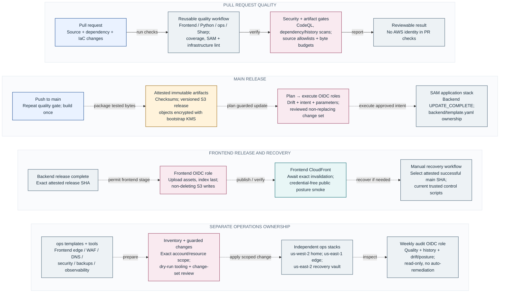

Normal main releases deploy the application stack and frontend artifacts; they do not automatically deploy every ops stack. Four OIDC roles separate plan, execute, frontend and audit authority; CloudFormation has its own execution role. Existing parameters and protected resources are preserved by exact release contracts. bootstrap owns roles, release artifacts and KMS. See CI_CD.md for authoritative deployment guards and recovery procedure.

Sources: [.github/workflows/_quality.yml](../.github/workflows/_quality.yml), [.github/workflows/pull-request.yml](../.github/workflows/pull-request.yml), [.github/workflows/release-production.yml](../.github/workflows/release-production.yml), [.github/workflows/manual-release.yml](../.github/workflows/manual-release.yml), [.github/workflows/scheduled-security.yml](../.github/workflows/scheduled-security.yml), [backend/Makefile](../backend/Makefile), [ops/CI_CD.md](../ops/CI_CD.md), [ops/ci_bootstrap_template.yaml](../ops/ci_bootstrap_template.yaml).

## 11 · Observability, security and recovery

Website incident delivery, account audit evidence and data recovery are separate paths. [Open this view in Miro](https://miro.com/app/board/uXjVHsf6LH0=/?moveToWidget=3458764682780889047).

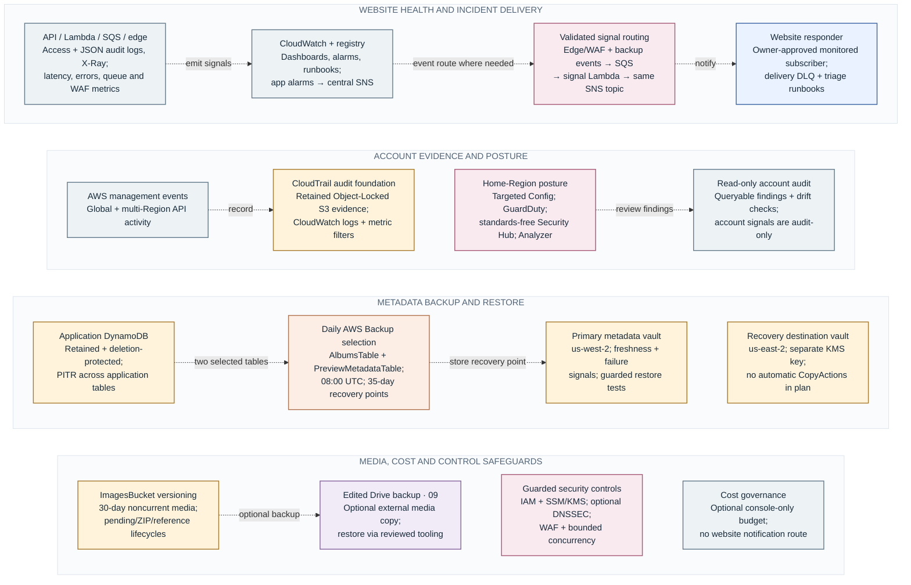

No deployed cross-Region copy schedule is inferred from a destination vault: the checked-in primary plan has no CopyActions. AWS Backup selects only AlbumsTable and PreviewMetadataTable; other application tables rely on their PITR/retention unless separately configured. OriginalPreviewBucket holds private derived Before assets and expiring index snapshots; it does not inherit ImagesBucket versioning. Account posture services are home-Region-only and do not forward account-wide findings to website email. Ops creation modes, DNSSEC, Vault Lock and budget remain explicitly conditional. Complete resources and alarm ownership are in the inventories.

Sources: [ops/SECURITY_OBSERVABILITY.md](../ops/SECURITY_OBSERVABILITY.md), [ops/OBSERVABILITY.md](../ops/OBSERVABILITY.md), [ops/ALARM_REGISTRY.md](../ops/ALARM_REGISTRY.md), [ops/security_notifications_template.yaml](../ops/security_notifications_template.yaml), [ops/security_audit_foundation_template.yaml](../ops/security_audit_foundation_template.yaml), [ops/security_managed_services_template.yaml](../ops/security_managed_services_template.yaml), [ops/security_backup_template.yaml](../ops/security_backup_template.yaml), [ops/security_backup_replica_template.yaml](../ops/security_backup_replica_template.yaml), [ops/security_budget_template.yaml](../ops/security_budget_template.yaml), [ops/dnssec-key-template.yaml](../ops/dnssec-key-template.yaml).

## Maintenance

Edit [architecture/model.py](architecture/model.py), then run `python3 ops/architecture/build.py`. This regenerates all Mermaid files, this atlas, the README overview and the source inventory. Add `--miro-dir /tmp/photography-atlas` to generate matching native-shape Miro DSL for an authorized board update. The command itself never modifies Miro or AWS.

Route/function/resource coverage is checked against source during generation. Update the data-responsibility mapping whenever a table or bucket is added. Each view lists the implementation and runbooks used to verify its relationships.
